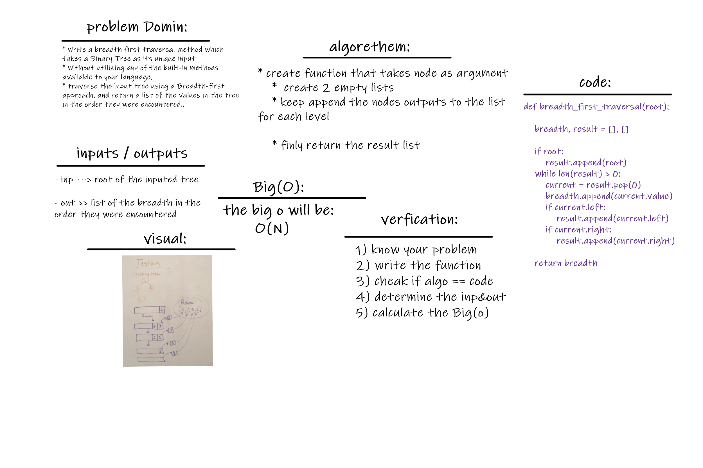

# Breadth First Traversal :
 

## Challenge
Tree one of the most famous data structres in the world .. and there is many ways to implement it..
and this metohd is writen to return list of 'Breadth First Traversal' in the order they were encountered

## Approach & Efficiency
The most efficent way to keep track of each node on each level before moving on has to be by using a queue. When a node is reached that means that it is at the front of the queue. So it is then safe to remove it from the queue -- dequeue it..
When we remove the node from the queue, we want to take its value and append it to our list that is keeping track of all the values in the binary tree (breadth first). Additionally we need to add any and all the immediate children of the dequeued node to the end of the queue -- enqueue them.

 

## Solution

