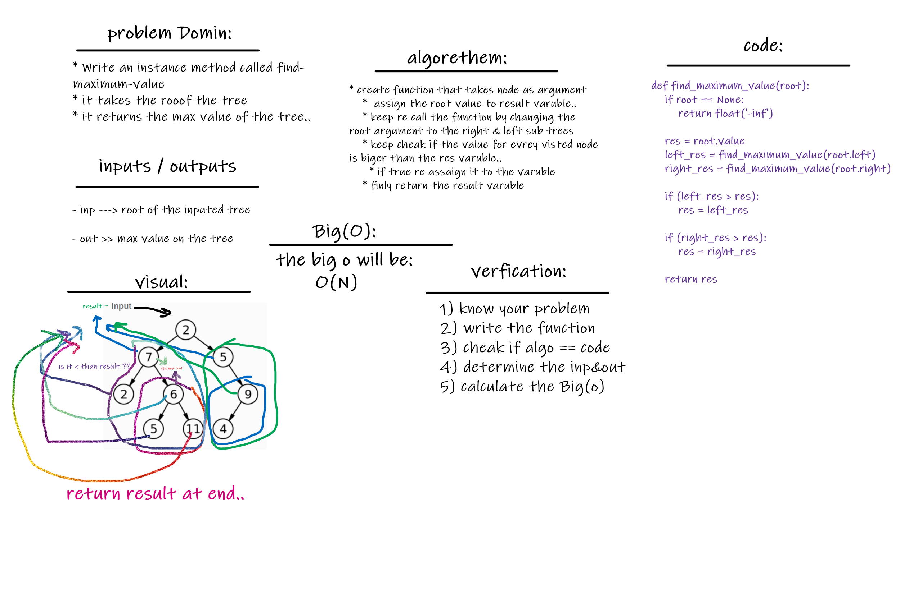

# Find Max Value In Binary Tree :
 

## Challenge
Tree one of the most famous data structres in the world .. and there is many ways to implement it..
and this metohd is writen for finding the maximum value in the inputed tree..

## Approach & Efficiency
well for me .. i learned alot that is alot ways to slove proplem but always the best solution is which dosent need alot of time and memory to excute and get you the answer..
no mater how data you had..or even in worst case it is!!

 

## Solution

