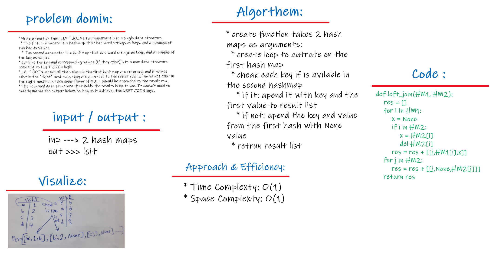

# Left Join

<br>
<hr>

## Problem domain
This challenge asks us to write a function that takes two hash tables as arguements and returns a list of the joined key/values. If there is no match in the second hash table for a given key, the list will include None for as the value joined from the 2nd hash table.

<br>

## Challenge
Iterate through the entire 1st hash table (the left table) and when an element is found, check if that element's key exists in the second hash table. If it does, append (key, value_1, value_2) if it does not append (key, value_1, None).


```
      HashTable 1                HashTable 2       (key/values)
    'fond'| 'enamored'        'fond'| 'averse'
   'wrath'| 'anger'          'wrath'| 'delight'
'diligent'| 'employed'    'diligent'| 'idle'
  'outfit'| 'garb'           'guide'| 'follow'
   'guide'| 'usher'           'flow'| 'jam'
```

***Returns a list:*** [['fond', 'enamored', 'averse'], ['wrath','anger','delight'], ['diligent','employed','idle'], ['outfit','garb', None], ['guide','usher','follow']]

<br>

## Approach & Efficiency
- We need to join all of the values from hash table 2 with the values from hash table 1 at all the keys (columns) in hash table one. Because our function is not aware of any of the keys in either hash table, the approach here is to iterate through the entire length of hash table 1 and find all of the elements. As we iterate index by index if the index contains an element (is not None/null) then we need to check hash table 2.

- We check hash table 2 using the key from the found element in hash table 1. We want to see if ht2 contains an element with that same key. If it does, we append (key, value_1, value_2) to a list localy defined in the function. In the case that ht2 does not contain an element with the same key, we append (key, value_1, None) to our local list.

- After all of ht1 is iterated through we return our list, giving us a left-join.

<br>

## The bigO for this approach is:

1. O(n) for time - every index in hash table 1

    * &

2. O(n) for space - the local list that is created.

<br>
<hr>

# Solution

