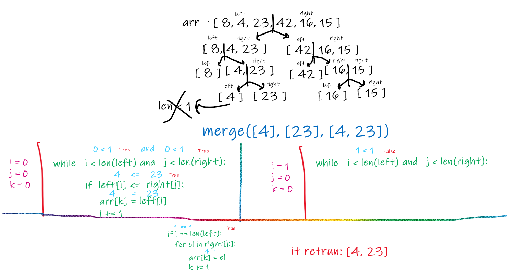
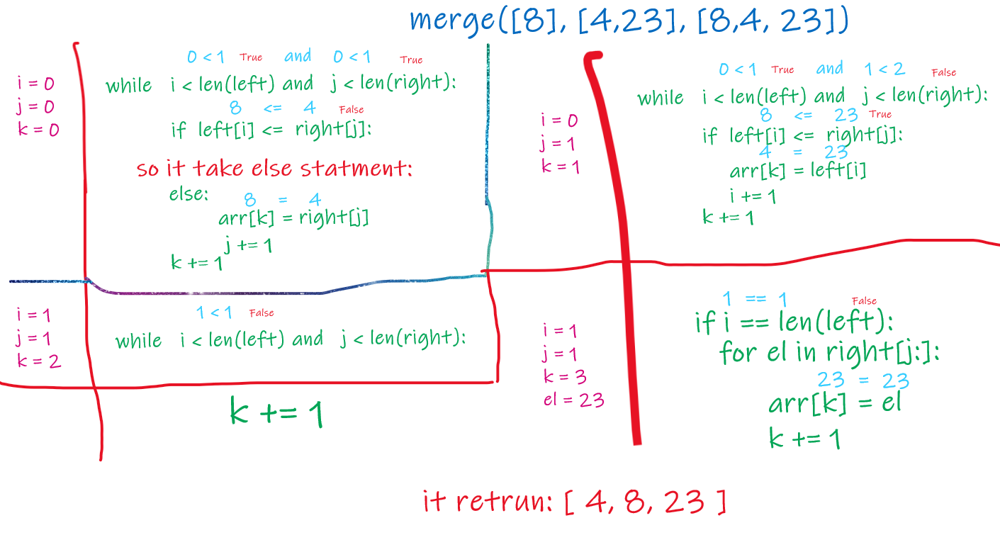
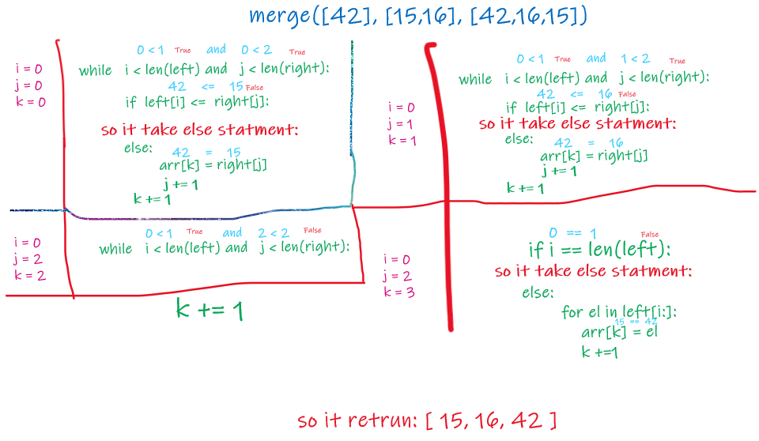
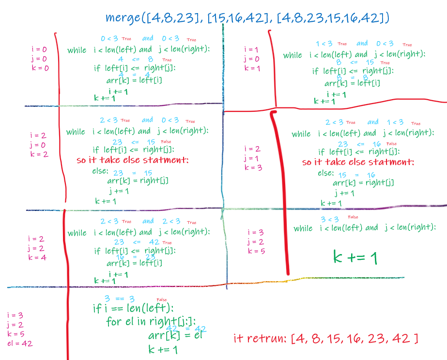

# Merge Sort

* Merge sort breaks a list up into the smaller lists than merges the lists back together in order.

    * Merge sorts a fast but require a big amount of memory.
    * Merge Sort is useful for sorting linked lists.
    * Merge Sort is a stable sort which means that the same element in an array maintain their original positions with respect to each other.

To sort a sequence S with n elements using the three divide-and-conquer steps, the merge-sort algorithm proceeds as follows:

1. Divide: If S has zero or one element, return S immediately; it is already sorted. Otherwise (S has at least two elements), remove all the elements from S and put them into two sequences, S1 and S2, each containing about half of the elements of S; that is, S1 contains the first [n/2] elements of S, and S2 contains the remaining [n/2] elements.

2. Conquer: Recursively sort sequences S1 and S2.

3. Combine: Put back the elements into S by merging the sorted sequences S1 and S2 into a sorted sequence.

<br>

# Pseudocode

```
 ALGORITHM Mergesort(arr)
    DECLARE n <-- arr.length

    if n > 1
      DECLARE mid <-- n/2
      DECLARE left <-- arr[0...mid]
      DECLARE right <-- arr[mid...n]
      // sort the left side
      Mergesort(left)
      // sort the right side
      Mergesort(right)
      // merge the sorted left and right sides together
      Merge(left, right, arr)

ALGORITHM Merge(left, right, arr)
    DECLARE i <-- 0
    DECLARE j <-- 0
    DECLARE k <-- 0

    while i < left.length && j < right.length
        if left[i] <= right[j]
            arr[k] <-- left[i]
            i <-- i + 1
        else
            arr[k] <-- right[j]
            j <-- j + 1

        k <-- k + 1

    if i = left.length
       set remaining entries in arr to remaining values in right
    else
       set remaining entries in arr to remaining values in left
```
<br>
<hr>

# Trace

Sample array: [8,4,23,42,16,15]

<br>

## Pass 1
first it will split the array into two arrays then split each into two arrays until each array length >= 1 , then start with merge first elemnts ([4,23]) with compare betwin and let the lesser become first..



<br>

## Pass 2
then merge function will move to the bigest ([8,4,23]) array and compare each element and let the lesser first



<br>

## Pass 3
then merge function will move to the right side of the array and start with last split ([16,15]) then compare each element and let the lesser become first..


<br>

## Pass 4
then merge function will move to the bigest arry ([42,15,16]) then compare each element and let the lesser become first..



<br>

## Pass 5
at the last merge function start compare betwin ecah two splits and merge them with letting the less become first..



Sorted array: [4, 8, 15, 16, 23, 42]

<br>
<hr>

# Efficiency

***Space complexity Big O(n)***

***Time complexity Big O(nLogn)***