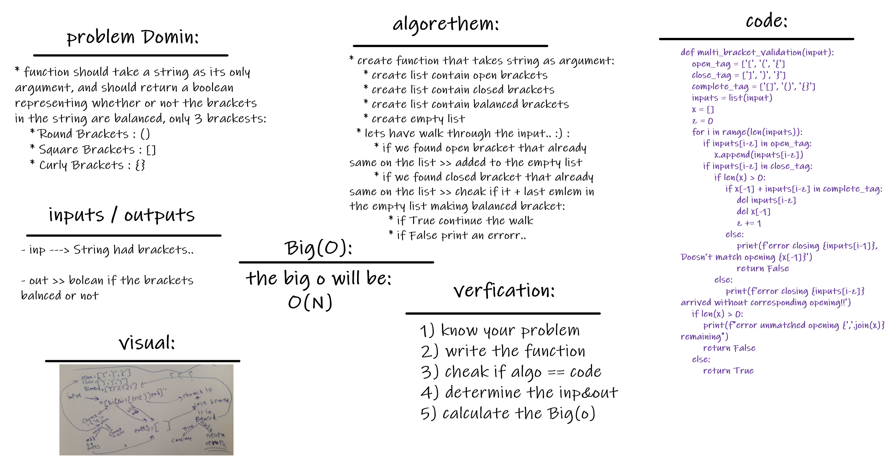

# Multi Bracket Validation:
there is alot of solutions and algorithms to cheack if the string had closed brackets very well .. checkout them here..

 

## Challenge
this challenge are trying to let you get many solutions for 'multi_bracket_validation' .. then get the least complicated one..
somehow 'getting the Big O Notation'..!

it was fun and cool to try it :)

 

## Approach & Efficiency
well for me .. i learned alot that is alot ways to slove proplem but always the best solution is which dosent need alot of time and memory to excute and get you the answer..
no mater how data you had..or even in worst case it is!!

its always the better performance way to work with..this is what called: (Big O)

 

## Solution

