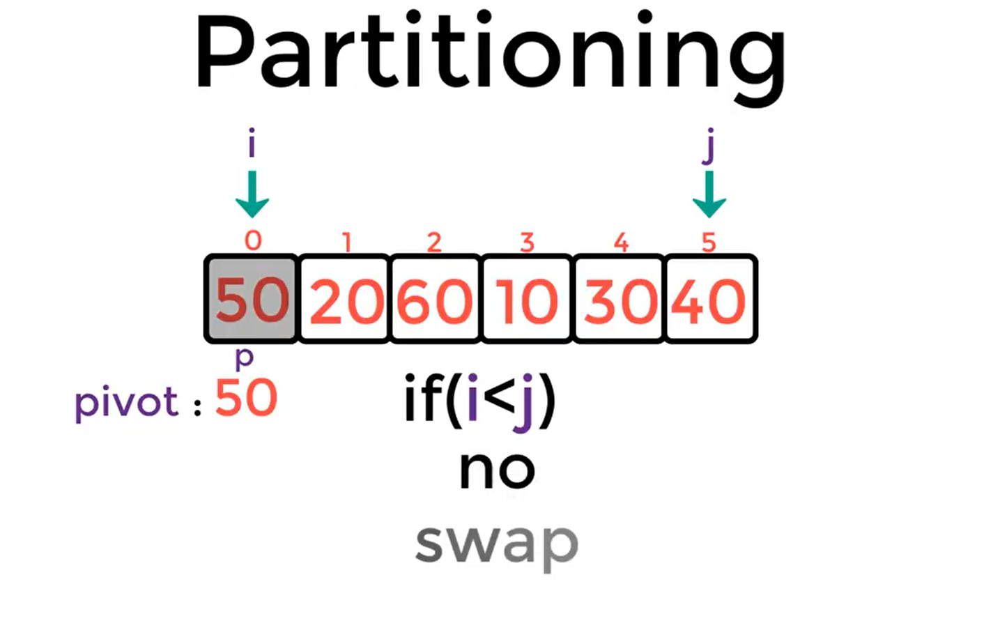
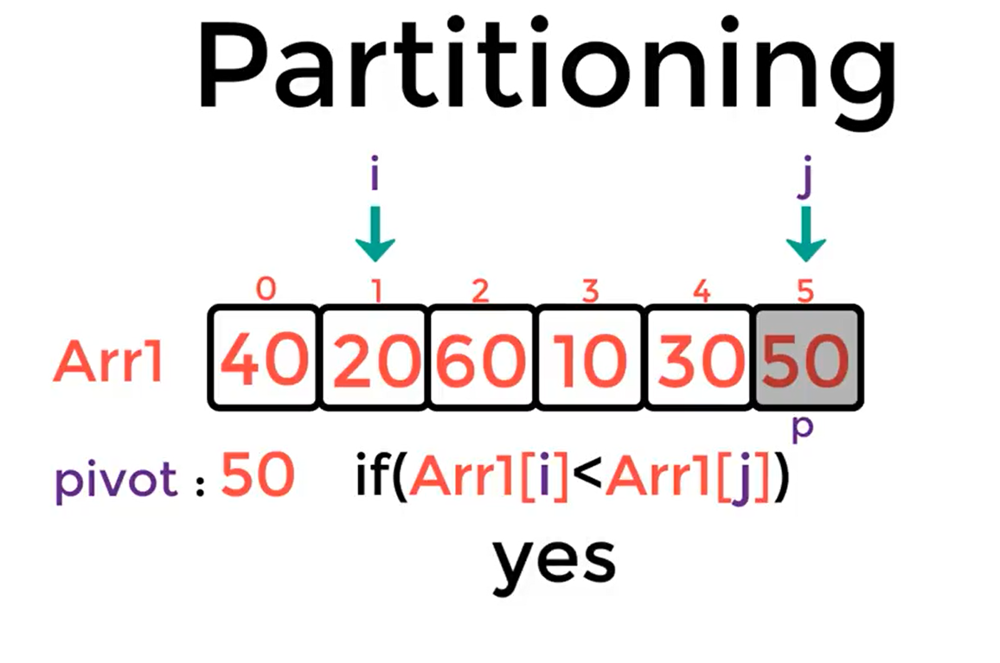
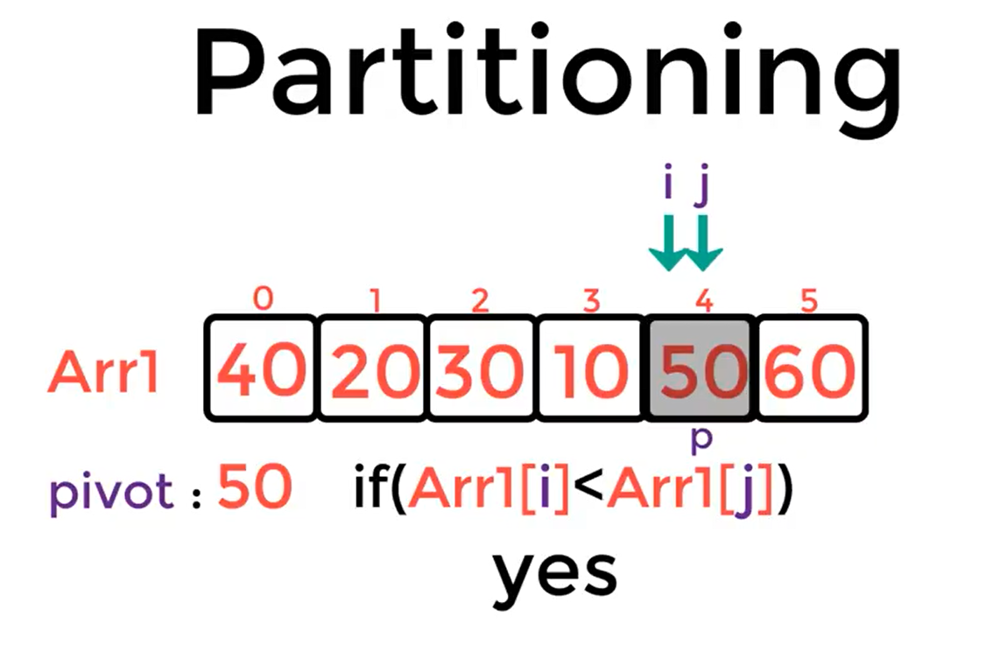
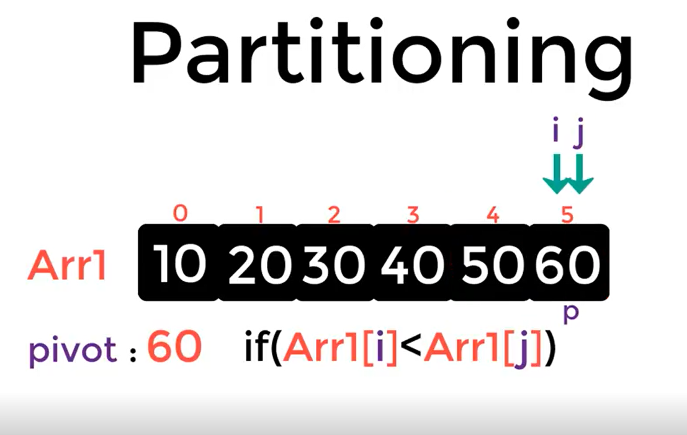

# Quick Sort

## Pseudocode
```
 ALGORITHM QuickSort(arr, left, right)
    if left < right
        // Partition the array by setting the position of the pivot value
        DEFINE position <-- Partition(arr, left, right)
        // Sort the left
        QuickSort(arr, left, position - 1)
        // Sort the right
        QuickSort(arr, position + 1, right)

ALGORITHM Partition(arr, left, right)
    // set a pivot value as a point of reference
    DEFINE pivot <-- arr[right]
    // create a variable to track the largest index of numbers lower than the defined pivot
    DEFINE low <-- left - 1
    for i <- left to right do
        if arr[i] <= pivot
            low++
            Swap(arr, i, low)

     // place the value of the pivot location in the middle.
     // all numbers smaller than the pivot are on the left, larger on the right.
     Swap(arr, right, low + 1)
    // return the pivot index point
     return low + 1

ALGORITHM Swap(arr, i, low)
    DEFINE temp;
    temp <-- arr[i]
    arr[i] <-- arr[low]
    arr[low] <-- temp
```

## Trace

Sample array: [50,20,60,10,30,40]

**begining**:
simply it will takes you to kuick sort an array two simple functions:

    1. partioning:
        witch will keep dividing the array after buting ecah element in own right sort place in the array..

    2. Recursivly:
        eah divided arry will re partioning..

### partioning:

* by choosing first element to partioning (pivot), then create two pointers to the first element and the last element of the inputed arr, then starting the algorithm:
    
    * if pivot < arr[j]:

        lets swap betwin them..
    * if not:

        lets movie our second pointer a step forwrd
<br>



* lets continue the process:





* and finly when 2pointers are equal .. we dvide the array and re partition each with same process untill geting one sorted arry..


# Sorted array: 



and simply thats it.. :)
<br>
<hr>

# Efficiency

1. Space complexity Big O(log(n))

2. Time complexity Big O(n^2)
