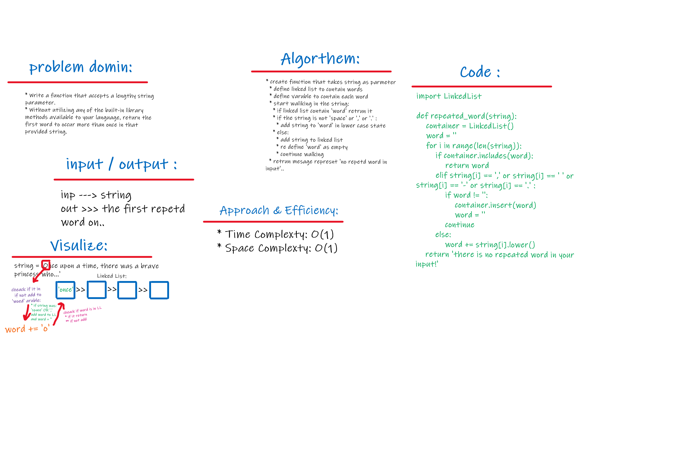

# Repeating Word Search
<br>
<hr>

## Problem domain:
This challenge asks us to write a function that takes a large string as an arguement and returns the first repeated word that is found.

<br>

## Challenge:
Take a string and iterate through the words in the string. Return the first instance of a repeated word.

```
string = "Once upon a time, there was a brave princess who..."
result = 'a'
```

<br>

## Approach & Efficiency:
The approach here is to get first repeated word for all of the words in the string. 
useing 'linked list' data structure let this chalenge use the linked list Big(O), and for sure it will get you the lowest for space complexity..

<br>

## * The efficency here is:
* O(1) for Time complexity 

    * & 

* O(1) for space complexity

<br>
<hr>

# Solution

