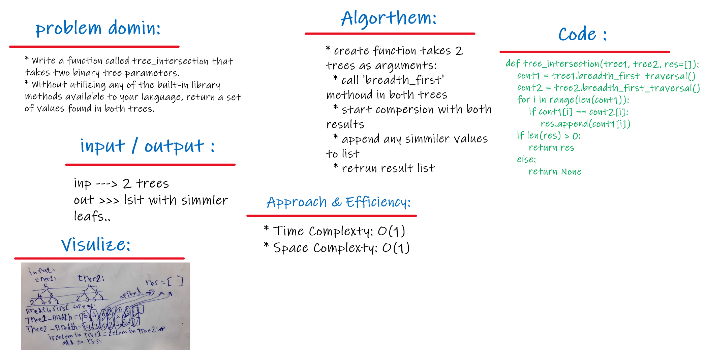

# Tree Intersection

<br>
<hr>

## Problem domain
This challenge asks us to write a function that takes two trees as arguments and returns a list of the elements that both have in common.

<br>

## Challenge
Traverse both trees keeping track of the values in each. Return a list of the elements that they have in common.

```
State of a given tree_one:      State of a given tree_two:
      root: [2]                         root: [12]                           
           /   \                             /   \
         [5]   [25]                         [7]   [55]
        /  \      \                       /  \      \
      [6]  [0]     [9]                  [2]  [6]     [100]
          /  \     /                   /   \    \
        [4]  [11] [100]               [5]   [4]   [0]
```

Returns a list: [2, 6, 100, 5, 4]

<br>

## Approach & Efficiency
The approach here is to define a helper function from the same tree 'breadth_first' witch use as Time complexity Big O(1) for both trees..

<br>
<hr>

# solution

