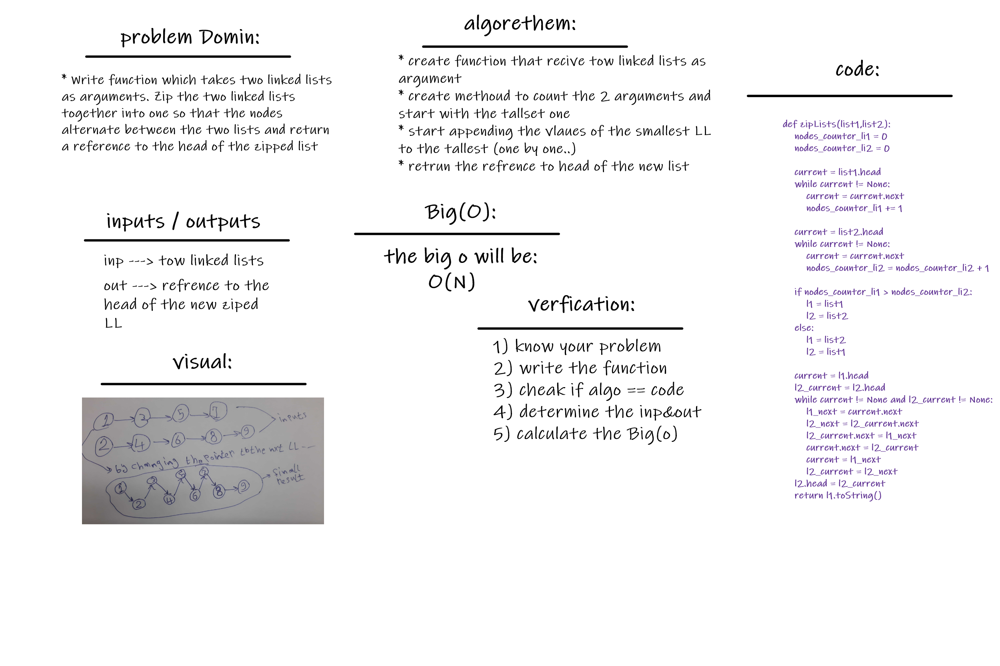

# Linked List Ziping
there is alot of solutions and algorithms to zip two linked lists .. checkout one of them here..

 

## Challenge
this challenge are trying to let you zip tow linked lists in one linked list by trying the less Bog(o) space..
it also been slovable by many ways

it was fun and cool to try it :)

 

## Approach & Efficiency
well for me .. i learned alot that is alot ways to slove proplem but always the best solution is which dosent need alot of time and memory to excute and get you the answer..
no mater how data you had..or even in worst case it is!!

 

## White Bored :

 

