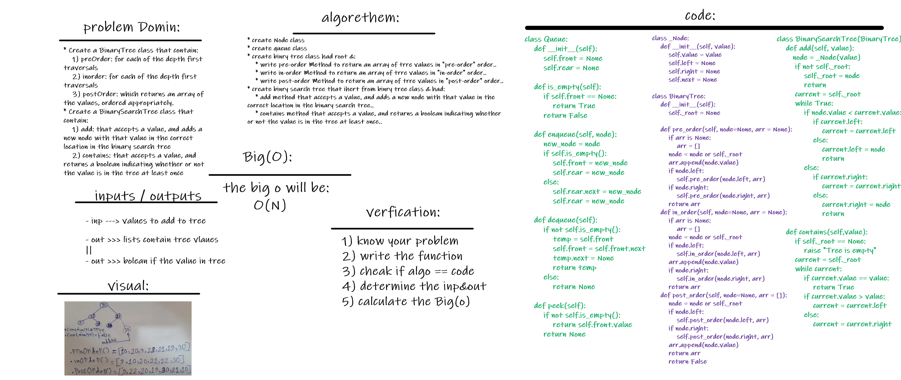

# Binary Tree :
 

## Challenge
Tree one of the most famous data structres in the world .. and there is many ways to implement it..

## Approach & Efficiency
well for me .. i learned alot that is alot ways to slove proplem but always the best solution is which dosent need alot of time and memory to excute and get you the answer..
no mater how data you had..or even in worst case it is!!

## API
BinaryTree():
    * .pre_order() - BinaryTree method to return an array of trre values in "pre-order" order
    * .in_order() - BinaryTree method to return an array of tree values "in-order"
    * .post_order() - BinaryTree method to return an array of tree values "post-order

BinarySearchTree(BinaryTree):
    * .add(value) - BinarySearchTree method that accepts a value, and adds a new node with that value in the correct location in the binary search tree
    * .contains(value) - BinarySearchTree method that accepts a value, and returns a boolean indicating whether or not the value is in the tree at least once.

 

## Solution

> ## Note: Done with Ahmad Swedani as pair programing.. :) 